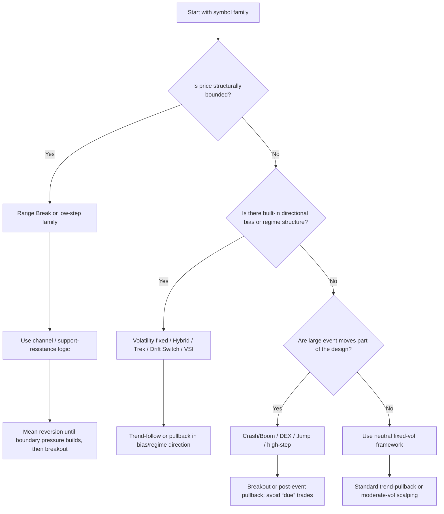

# Deriv Synthetic Indices Trading Research

## Executive summary

Deriv’s synthetic indices are proprietary, algorithmically generated markets that run continuously, are insulated from macro news, and are built to exhibit specific statistical behaviours such as fixed volatility, timed directional spikes, bounded ranges, fixed step sizes, or regime switching. The current public Deriv materials show a broad universe that now includes fixed-volatility indices, Crash/Boom, Jump, Range Break, Step, Multi Step, Skew Step, Hybrid, DEX, Drift Switch, Spot Volatility, Trek, Daily Reset, and Volatility Switch families; most are tradeable 24/7, while Volatility Switch Indices and Stable Spread Instruments are currently demo-only, and Trek is also currently described as demo-only in Deriv Academy materials. citeturn30view0turn24view0turn28view2turn28view1

For practical trading, the most useful way to measure synthetic-index price movement is not just “points moved”, but **movement relative to the family’s design**: fixed volatility level, tick speed, average event interval, average regime duration, fixed step size, or channel-break frequency. In other words, Volatility 10 and Volatility 250 should not be analysed with identical thresholds, and DEX or Crash/Boom symbols should not be treated as if their average event intervals are countdown timers. Deriv’s own product pages explicitly frame these instruments in terms of volatility tiers, tick speeds, step sizes, average spike intervals, or regime durations. citeturn30view0turn23search0turn20search0turn22search0turn27search0

A key nuance in the official material is that Deriv’s **product FAQ is more sceptical about technical indicators** than Deriv’s training content. The FAQ says that, except for Range Break Indices, synthetic indices “may not be well-suited” to technical indicators because there is no order book and any noticeable historical patterns are coincidental; but Deriv Academy and the official ebook still teach moving averages, RSI, MACD, Donchian channels, Bollinger-Band-based mean-reversion concepts, and ATR-based risk management for synthetic indices. The most rigorous interpretation is to use indicators on synthetics as **statistical filters and risk tools**, not as causal market microstructure signals. citeturn30view0turn33search4turn37view0turn37view1turn38view3turn17search0

At strategy level, the family matters more than the indicator brand name. Trend-pullback logic fits fixed-volatility, Drift Switch, Trek, and many Hybrid symbols best; bounded mean-reversion fits low-volatility and Range Break families best; Donchian or squeeze breakouts fit Range Break, high-volatility, DEX, Jump, and high-step symbols best; and scalping works best where movement is continuous but not chaotic enough to make fast oscillators unusable. Community evidence is limited and heavily biased, but one 1,000-trade Volatility 75 journal found a moving-average pullback setup more consistent than pure RSI reversal fading, while Bollinger-style breakouts delivered the largest winners at the cost of deeper losing streaks. citeturn14view0turn39view2turn37view1turn9search0

## Scope and assumptions

This report assumes the user is speaking primarily about **manual or semi-systematic CFD trading** of Deriv synthetic indices on platforms such as Deriv MT5, Deriv cTrader, Deriv X, or TradingView-linked interfaces, rather than binary options, multipliers, or copy-trading products unless specifically noted. It also assumes no fixed timeframe preference, so the recommendations below map each setup to the timeframe range that Deriv’s own training materials or strategy posts most commonly attach to it. citeturn30view0turn37view0turn37view1turn16search2

Where Deriv gives explicit parameters, those are reported as-is. Where this report recommends adjusted settings by volatility class, those adjustments are **analytical starting points**, synthesised from Deriv’s descriptions of the instrument families, the official ebook’s worked examples, Deriv Academy’s advanced-course curriculum, and community/backtest material. They should be treated as calibration hypotheses to validate on demo or replay data rather than as Deriv-endorsed optimums. Deriv itself states that educational materials are not investment advice and that demo results do not guarantee live results. citeturn13view0turn37view0turn37view1turn10search8

One important data gap is **Daily Reset symbol naming**. The current synthetic-indices product page confirms that Daily Reset is an active family, but the accessible current pricing/help pages surfaced in this research did not expose the exact instrument-by-instrument names, whereas other families were enumerated clearly. I therefore include Daily Reset as a confirmed family, but flag its individual symbol list as not fully surfaced in the indexed public references available here. citeturn30view0turn32search0turn24view0

## Deriv synthetic index universe

The current public Deriv pages expose the following synthetic-index families and, in most cases, the current instrument names. All of the families below are described by Deriv as synthetic or proprietary derived markets generated by cryptographically secure algorithms and generally available 24/7, with the stated exceptions for demo-only access. citeturn30view0turn24view0turn28view2turn28view1

| Family | Current symbols surfaced in official pages | Underlying characteristic most relevant to traders | Sessionality / timing structure |
|---|---|---|---|
| Volatility Indices | Volatility 10, 25, 50, 75, 100; Volatility 10 (1s), 15 (1s), 25 (1s), 30 (1s), 50 (1s), 75 (1s), 90 (1s), 100 (1s), 150 (1s), 250 (1s) | Fixed volatility level and tick speed | 24/7; 1-second or 2-second tick families |
| Crash/Boom | Boom 150, 300, 500, 600, 900, 1000; Crash 150, 300, 500, 600, 900, 1000 | Average interval between uni-directional spikes | 24/7; spike interval specified in ticks |
| Jump | Jump 10, 25, 50, 75, 100 | Equal-probability jumps around 30x normal volatility | 24/7; jump event roughly every 20 minutes on average |
| Range Break | Range Break 100, Range Break 200 | Bounded range then breakout after repeated boundary hits | 24/7; break frequency framed by average boundary touches |
| Step | Step Index, Step Index 200, 300, 400, 500 | Fixed step size per tick | 24/7; no macro sessionality |
| Multi Step | Multi Step 2, 3, 4 | Mostly 0.1 steps with occasional larger steps | 24/7 |
| Skew Step | Skew Step 4 Up, 4 Down, 5 Up, 5 Down | Asymmetric step sizes and probabilities | 24/7 |
| DEX | DEX 600 UP/DOWN, DEX 900 UP/DOWN, DEX 1500 UP/DOWN | Rare large event moves plus small interim fluctuations | 24/7; large event interval framed in seconds |
| Drift Switch | Drift Switch Index 10, 20, 30 | Alternates bull/bear/sideways regimes | 24/7; regime duration averages 10/20/30 minutes |
| Spot Volatility | Spot Up - Volatility Up; Spot Up - Volatility Down | Volatility adjusts by 1% per 100 points within a band | 24/7 |
| Hybrid | Vol over Boom 400, 550, 750; Vol over Crash 400, 550, 750 | Crash/Boom-style directional bias plus ~20% volatility overlay | 24/7 |
| Trek | Trek Up, Trek Down | 30% volatility target with built-in directional skew and Weibull-pattern asymmetry | 24/7; currently described as demo-only |
| Volatility Switch | VSI Low, VSI Medium, VSI High | Random switching among low/medium/high volatility regimes | 24/7; currently described as demo-only |
| Daily Reset | Family confirmed, exact symbol names not surfaced here | Simplified bull/bear trend that resets daily to baseline | Daily reset to baseline |

Source basis for the table above: Deriv’s synthetic-indices page, partner commission tables, Trek guide, and Volatility Switch guide. citeturn30view0turn24view0turn25view0turn25view1turn25view2turn25view4turn28view2turn20search0

A second table is useful because traders care not only about the name, but about the **price-generation logic** they are effectively trading.

| Family cluster | What the price generator is trying to simulate | Best interpretation for entry work |
|---|---|---|
| Fixed-volatility families | A market with statistically stable volatility and no external news shock | Treat these as the cleanest candidates for trend, pullback, and volatility-normalised analysis |
| Event families | Rare outsized moves separated by smaller fluctuations | Avoid “it is due” thinking; use event-aware stops and breakout logic |
| Bounded/ranging families | Price oscillation inside levels before sudden range resets | Favour support/resistance, channel, and breakout tools |
| Step families | Mechanically defined tick increments, with or without asymmetry | Think in steps-per-bar, not generic candlestick psychology alone |
| Regime-switch families | Alternation between drift or volatility states | Align trade duration with regime duration; late-regime chasing is structurally weaker |
| Directionally skewed families | Small moves dominate, but large moves favour one side | Prefer pullbacks in the built-in bias direction over symmetric mean-reversion |

That interpretation follows directly from Deriv’s family descriptions for Volatility, Crash/Boom, Jump, Range Break, Step, DEX, Drift Switch, Hybrid, Trek, and VSI. citeturn30view0turn23search0turn22search0turn27search0turn26search0turn28view2turn20search0

## Measuring price movement and adapting indicators

The simplest but least useful measurement on synthetics is raw points. More informative measures are **ATR or ATR as a percentage of price**, realised range per bar, Donchian or Bollinger width, step size, average interval between large events, and regime duration. Deriv Academy’s ATR guide explicitly teaches ATR for volatility-sensitive stop placement and position sizing, while the synthetic-indices product pages frame many symbols by volatility tier, tick speed, or average spike/regime interval. citeturn17search0turn30view0turn20search0turn22search0turn27search0

There is also an important methodological caveat. Deriv’s public FAQ says that, except for Range Break Indices, synthetic indices may not be well suited to technical indicators because there is no order book and observable historical patterns are coincidental. At the same time, Deriv Academy’s advanced Volatility Indices course explicitly teaches moving averages, Bollinger Bands, mean reversion, Sharpe-ratio evaluation, and risk parity, and the official synthetic-indices ebook demonstrates RSI, MACD, Donchian channels, moving-average crossover logic, and Stochastic-based scalping. The best reconciliation is to use indicators **probabilistically**: as repeatable filters for setup quality and risk control, not as deterministic market-structure truth. citeturn30view0turn33search4turn39view1turn38view3turn37view0turn37view1turn39view3

The table below gives a practical calibration framework. These are **starting settings**, not fixed rules.

| Volatility class | Typical Deriv symbols | MA / trend settings | Mean-reversion settings | Volatility settings | Practical note |
|---|---|---|---|---|---|
| Low and structured | Vol 10, Vol 10 (1s), Step, Step 200, Range Break 200, Trek | Faster filters work: 20/50 SMA or 20/50 EMA | RSI 30/70 or Bollinger 20, 2.0 are usable | ATR 14 often adequate; stops can be tighter in relative terms | Best for clean pullbacks and bounded mean reversion |
| Medium balanced | Vol 25, Vol 50, Vol 25 (1s), Vol 50 (1s), Step 300, Multi Step, Drift Switch 30 | 20/50 or 34/89 works well; MACD 12/26/9 is still responsive | RSI 30/70 for flat markets; 20/80 if trends extend | ATR 14–21; Bollinger 20, 2.0–2.25 | Good “default” class for most discretionary traders |
| High trend/event | Vol 75, Vol 100, Vol 75 (1s), Vol 100 (1s), Jump 50–100, Hybrid, DEX 900/1500, Step 400–500 | Slow the filter: 34/89 or 50/200; require multi-indicator confirmation | RSI thresholds usually need widening to 20/80; Bollinger often better at 2.25–2.5 | ATR 21 or volatility-normalised stops | Pure fading becomes fragile; prefer pullback or breakout |
| Extreme and fast | Vol 150 (1s), Vol 250 (1s), Crash/Boom 150–300, DEX 600, VSI High | Heavier smoothing or higher timeframe confirmation is essential | Mean reversion only after clear re-entry/confirmation, not first touch | ATR-based stops and smaller size are mandatory | Noise and event risk dominate; avoid over-frequent entries |

The rationale for this scaling comes from Deriv’s volatility tiers and tick-speed descriptions, the official swing/scalping systems, the MACD/RSI examples in the ebook, and the community/backtest evidence showing that aggressive reversal logic degrades on very fast symbols. citeturn11search0turn37view0turn37view1turn39view1turn38view3turn9search0

A few indicator-specific conclusions follow.

**Bollinger Bands.** Deriv’s advanced course explicitly includes Bollinger Bands for volatility-index trading, and a prominent community backtest on Volatility 75 found Bollinger-squeeze breakout logic profitable even with a sub-50% win rate because the payoff ratio was higher. On slow symbols, a standard 20-period / 2-standard-deviation setting is a reasonable baseline; on high-volatility symbols, widening to 2.25–2.5 or increasing the lookback helps reduce false touches. citeturn33search4turn9search0

**RSI.** The official ebook uses the standard 14-period RSI with 70/30 levels, and explicitly notes that traders can test 20/80 as a stricter alternative. That is especially sensible on Volatility 75, 100, 150, and 250-style symbols, where persistent trends make early fading expensive. citeturn39view1turn37view0turn9search0

**MACD.** The ebook uses standard 12/26/9 settings and treats MACD as a trend-following momentum indicator on Volatility 25. On faster families, the biggest practical improvement is not usually “faster MACD”, but pairing MACD with a higher-timeframe trend filter so that histogram flips are taken only in the dominant direction. citeturn38view3turn11search0

**ATR.** ATR is one of the most transferable tools across synthetic families because it does not try to predict direction; it measures movement magnitude. Deriv Academy explicitly recommends ATR for stop-loss placement, take-profit calibration, and volatility-aware position sizing. That makes ATR more robust on synthetics than indicators that depend on assumptions about crowd behaviour or centralised volume. citeturn17search0turn10search3

**VWAP.** VWAP is not a Deriv-specific tool and is weaker on synthetic indices than on exchange-traded markets. Deriv’s FAQ states there is no order book for synthetic indices, and Deriv’s MT5 volume material describes indicator bars in terms of platform volume series rather than true exchange participation. The defensible use of VWAP on synthetics is therefore as an **anchored intraday reference line**, not as a true execution benchmark. That is an inference from the official market-structure description, and it should be treated cautiously. citeturn30view0turn19search7

**Custom indicators.** Deriv’s community materials confirm support for MT5 indicators, including installation of custom indicators, built-in trend indicators, oscillator categories, and saving layouts. In practice, this means traders often use custom spike filters, smart-money overlays, or regime detectors on synthetic indices, but the burden of validation is entirely on the trader. citeturn19search2turn18search4turn19search4

## Entry and exit frameworks

The cleanest decision process is to choose the **family first**, then the strategy, then the indicator stack.

That flow follows directly from Deriv’s description of bounded Range Break indices, directional/regime families such as Drift Switch, Hybrid, Trek, and VSI, and event families such as Crash/Boom, Jump, and DEX. citeturn30view0turn23search0turn26search0turn28view2turn20search0turn27search0turn22search0

The table below consolidates the most defensible entry and exit frameworks from official and community material.

| Strategy | Indicator stack | Entry logic | Exit logic | Best-fit symbol families |
|---|---|---|---|---|
| Trend following | 20/50 SMA or EMA; optionally MACD 12/26/9; RSI filter above/below 50 | Buy when fast MA crosses above slow MA, RSI is supportive but not extreme, and price pulls back to the fast MA; reverse for shorts | Swing high/low target, opposite MA cross, or ATR trail | Volatility 25–100, Trek, Drift Switch, Hybrid |
| Mean reversion | Bollinger Bands, RSI 14, optionally flat-trend filter | Fade only after price stretches and then re-enters the band or after RSI extreme with loss of trend pressure; stricter 20/80 on fast symbols | Mid-band / moving-average reversion or opposite band | Vol 10–25, Step, Step 200, Range Break inside range |
| Breakout | Donchian 20, Bollinger squeeze, support/resistance | Enter on close beyond upper/lower channel or beyond a repeatedly tested range edge | Middle band/channel as warning, opposite band, ATR stop, or momentum failure | Range Break 100/200, Vol 100–250, DEX, Jump, high-step, Hybrid |
| Scalping | 8 EMA + Stochastic 5/3/3; or 200 EMA + RSI 14 on Boom/Crash community setup | Trade in trend direction, then use oscillator reset for timing on M5 or M1 | Fixed small target, opposite oscillator extreme, or tight structural stop | Vol 25–75, moderate-vol intraday symbols; selective Boom/Crash scalps |

These frameworks are grounded in the official ebook’s swing system using 20/50 SMA plus RSI on H1/H4, the official Donchian breakout section, the official MACD overview, the official scalping system using 8 EMA and Stochastic on M5, and a Deriv community Boom/Crash post using 200 EMA + RSI + optional MACD on M1. citeturn37view0turn39view2turn38view3turn37view1turn6search5

Two examples are especially solid because they come from Deriv’s own ebook.

The **official swing template** uses H1 or H4 charts, a 50-period SMA, a 20-period SMA, and RSI(14). The long entry is a 20-above-50 bullish structure with RSI above 50 but below 70, followed by a pullback to the 20 SMA; the short entry mirrors that logic. The ebook also suggests that faster symbols should generally have wider expected targets, since Volatility 100 moves faster than Volatility 10. citeturn37view0

The **official scalping template** uses M5, an 8 EMA, and Stochastic(5,3,3). A long setup requires price above the 8 EMA, Stochastic dipping below 20 and crossing back up, then entry on the next candle; the short setup is the mirror image. The ebook suggests a 0.5–1% target and a stop near 0.5% or the recent swing. That design makes more sense on moderate-volatility symbols; on extreme classes, the same fast setup should usually be paired with smaller size or a higher timeframe, otherwise noise dominates. citeturn37view1

## Risk management and empirical findings

The core risk metrics for synthetic-index trading are the same as for any systematic trading, but they matter more here because many Deriv families are **always on**, leverage can be high, and some symbols have deliberately engineered large-event risk. Deriv Academy’s guidance is consistent on four points: use position sizing, use stop-loss/take-profit, scale down when volatility is higher, and validate with demo or backtest before going live. The advanced Volatility Indices course also explicitly adds Sharpe ratio and risk parity to the evaluation toolkit. citeturn10search0turn10search4turn17search0turn10search8

| Metric | How to use it in synthetic-index trading | Practical interpretation |
|---|---|---|
| Position size | Risk-based sizing anchored to stop distance | Smaller size on higher-volatility or event families |
| ATR stop | Place stop at roughly 1.5–2.5 ATR depending on family | Wider on Jump/DEX/Crash/Boom/high-vol symbols |
| Expectancy | (Win rate × average win) − (loss rate × average loss) | Better than win rate alone for judging edge |
| Maximum drawdown | Largest peak-to-trough equity decline | Use to judge whether the strategy is psychologically and financially survivable |
| Sharpe ratio | Excess return divided by return volatility | Useful when comparing two synthetic-index systems with similar profit but different variability |

Deriv Academy supports risk-based position sizing and ATR-based stops directly, while standard finance references define maximum drawdown and Sharpe ratio in the conventional way. citeturn10search0turn17search0turn35search0turn35search1

A useful expectancy sanity check is the break-even relationship between win rate and payoff ratio. Because expectancy is what determines whether a strategy has positive edge, a lower win rate can still be perfectly viable if the payoff ratio is high enough. For example, a 1:1 payoff ratio breaks even around 50%; 1.5:1 breaks even around 40%; 2:1 around 33%; and 3:1 around 25%. That is why breakout systems on fast synthetics can work with lower hit rates than mean-reversion systems. citeturn34search6

The strongest publicly surfaced empirical comparison I found was a **single-trader 1,000-trade Volatility 75 journal/backtest**. It is not official Deriv research and should not be treated as universal, but it is still useful because it reports the same instrument, similar risk per trade, and multiple strategy classes.

| Source | Market / sample | Strategy | Reported result | Main limitation |
|---|---|---|---|---|
| BeCoin trader journal | Volatility 75; 1,000 logged trades over 4 months; 1% risk/trade | MA pullback | 56% win rate, 1.6:1 avg reward:risk, 9% max drawdown, +18% | Single trader, self-reported, live-journal style |
| BeCoin trader journal | Same | Bollinger/squeeze breakout | 48% win rate, 2.1:1 avg reward:risk, 14% max drawdown, +21% | Same; requires tolerating long losing streaks |
| BeCoin trader journal | Same | RSI reversal | 42% win rate, 1.2:1 avg reward:risk, 18% max drawdown, -11% | Same; strongly instrument-specific |

Those results align with the broader qualitative logic in Deriv’s own training materials: on faster synthetic symbols, trend-pullback and breakout structures tend to be more robust than simple first-touch overbought/oversold fading. citeturn9search0turn37view0turn39view1

Community and vendor material also shows that traders often adapt parameters sharply by symbol. A Deriv community Boom/Crash scalping post uses **200 EMA + RSI 14 + optional MACD** on M1, while one MQL5 Boom 600 EA guide recommends a **194-period EMA trend filter**, 200-point stop, and 100-point target on that single symbol. Those are not audited proofs of edge, but they are evidence that practitioners do not use one universal setting across all synthetic families. citeturn6search5turn36search1

The evidence base nevertheless remains weak. Deriv’s own materials are educational rather than performance-audited, community posts are mostly anecdotal, and vendor EA pages are incentivised and vulnerable to optimisation bias. Deriv Academy explicitly warns that demo success does not guarantee live success, and even MT5 backtesting discussions in the broader MQL5 community show why traders should be cautious about blindly trusting backtests. The rigorous standard is therefore: replay or demo validation, then small live capital, then journalled review of expectancy and drawdown. citeturn13view0turn6search3turn36search4

## Practical entry checklist by symbol family

The final question is the most actionable one: **what should a trader actually look for before entering?** The answer changes materially by family.

| Symbol family | What to look for before entry | What to avoid |
|---|---|---|
| Fixed-volatility indices | Clean slope in MAs, supportive MACD, pullback into trend, ATR expansion that is not yet extreme | Countertrend RSI fades on Vol 75–250 without a re-entry/reversal trigger |
| Crash/Boom | Clear structure before the event, room for stop outside noise, acceptance that average spike interval is probabilistic not scheduled | “It should spike now” entries, tight stops directly in spike path |
| Jump | Compression before expansion, wider stops, smaller size, confirmation candle on breakout | Mean-reverting the first large jump without evidence of exhaustion |
| Range Break | Repeated respect of visible boundaries, increasing tension near support/resistance, breakout close beyond the range | Taking middle-of-range trades with poor reward:risk |
| Step / Multi Step | Know the step size, use channel logic on lower variants, favour breakout logic on larger-step variants | Using the same point stop across Step 0.1 and Step 0.5 families |
| Skew Step | Trade with the structural bias after pullback; wait for directional reclaim after a sharp counter-move | Symmetric assumptions as if it were classic Step |
| DEX | Treat elapsed time since the last event only as context, not a timer; enter on post-compression breakout or pullback with event-aware risk | Martingale or averaging into the “expected” large event |
| Drift Switch | Align timeframe to the average regime duration; prefer entries early in fresh bull/bear phases | Chasing late into a regime just because the prior swing was strong |
| Hybrid | Use trend-plus-volatility logic; pullbacks in the bias direction are usually cleaner than blind fades | Assuming Hybrid behaves as mechanically as classic Crash/Boom |
| Trek | Directional pullbacks, especially when the larger move bias is still intact | Counter-bias scalps unless the move is obviously climactic |
| Spot Volatility | Measure move as percent-of-price or ATR%, because volatility shifts with price level | Fixed point targets that ignore the price/volatility linkage |
| VSI | First identify whether the instrument is in a low, medium, or high-volatility regime; then switch the tactic accordingly | Using one static stop/target template across all three regimes |

This checklist reflects the official family mechanics described by Deriv and the indicator/risk logic taught in Deriv Academy and the synthetic-indices ebook. citeturn30view0turn20search0turn28view2turn28view1turn23search0turn22search0turn27search0turn26search0turn17search0turn37view0turn37view1

The most robust overall conclusion is simple. On Deriv synthetics, **indicator choice matters less than structural fit**. If the family is bounded, use bounded logic. If it is event-driven, use event-aware logic. If it is biased or regime-based, trade with the bias or regime instead of fighting it. And because Deriv’s own documentation is explicit that these are algorithmic, order-book-free markets, the safest posture is to treat indicators as disciplined decision aids rather than as guarantees of repeatable causality. citeturn30view0turn14view0turn33search4turn17search0